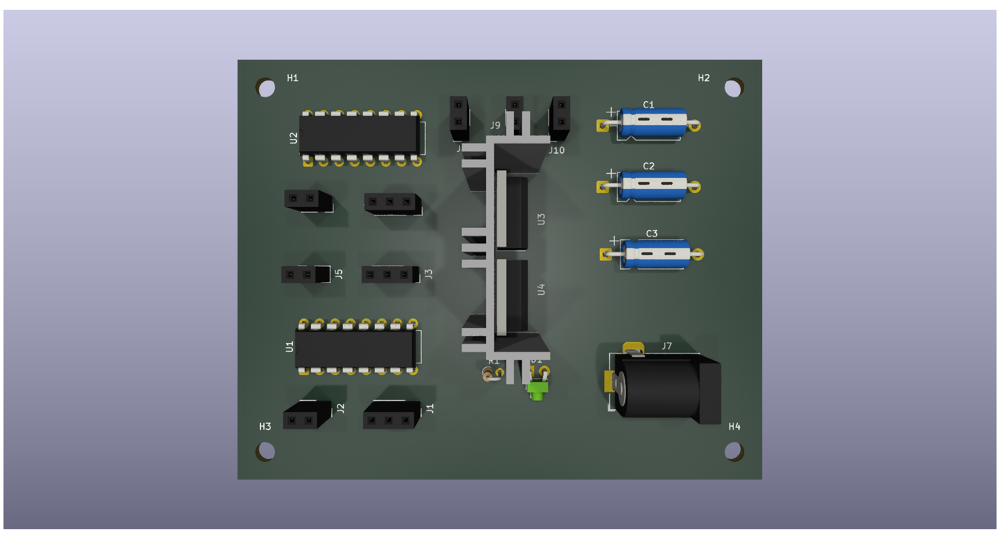
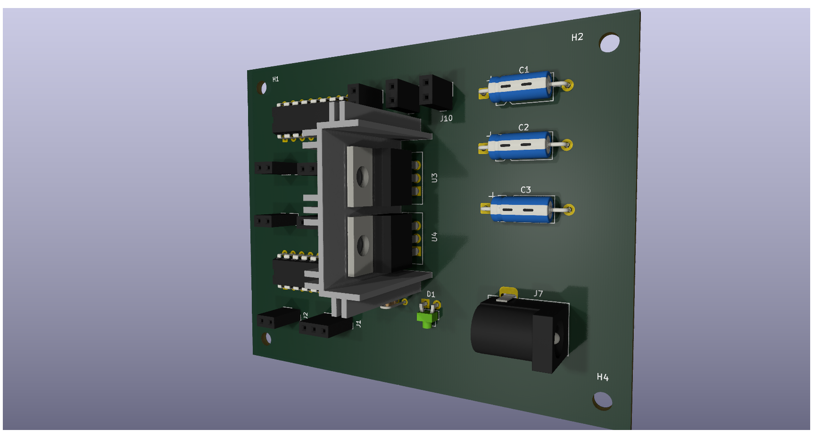

# Power Supply + Motor Driver – CpE 2303L Practical Activity

This repository contains the PCB project files for a **Power Supply and Motor Driver Module**, submitted as part of a practical activity in **CpE 2303L: Computer Engineering Drafting and Design**. The design integrates mechanical, electrical, and environmental considerations to ensure safe and reliable performance.

---

## 🧩 Features

- Combined **Power Supply** and **Motor Driver** on a single board
- **Heatsink integration** for TO-220 components
- **Current-rated track widths** based on component datasheets
- **Copper fill zones** for effective GND distribution
- Organized component layout for thermal and mechanical stability

---

## 📐 Design Considerations

### Mechanical
- 4x mounting holes (3.2mm) for stable board installation
- Copper pours help with EMI reduction and heat spreading

### Electrical
- Track widths adjusted based on current ratings from datasheets
- DIP-16 sockets for motor driver ICs (e.g., L293D)
- Barrel jack for DC input

### Environmental
- Heatsink for thermal dissipation on TO-220 components

---

## 🧱 Components Used

| Component | Quantity | Description |
|----------|----------|-------------|
| `Capacitor_THT:CP_Axial_L10.0mm_D4.5mm_P15.00mm_Horizontal` | 3 | Electrolytic capacitors |
| `LED_THT:LED_D1.8mm_W1.8mm_H2.4mm_Horizontal_O1.27mm_Z1.6mm` | 1 | Status/power LED |
| `MountingHole:MountingHole_3.2mm_M3` | 4 | Mounting holes |
| `Connector_PinSocket_2.54mm:PinSocket_1x03_P2.54mm_Vertical` | 3 | Pin headers |
| `Connector_PinSocket_2.54mm:PinSocket_1x02_P2.54mm_Vertical` | 6 | Pin headers |
| `Connector_BarrelJack:BarrelJack_Horizontal` | 1 | DC power input |
| `Resistor_THT:R_Axial_DIN0204_L3.6mm_D1.6mm_P1.90mm_Vertical` | 1 | Resistor (e.g., for LED) |
| `Package_DIP:DIP-16_W7.62mm` | 2 | IC sockets (motor drivers) |
| `Package_TO_SOT_THT:TO-220-3_Vertical` | 2 | TO-220 voltage regulators/drivers |
| `MyLibrary:HEATSINKUS-V` | 1 | Custom TO-220 heatsink footprint |

---

## 🛠️ Custom Heatsink

- **`HEATSINKUS-V`** is a custom symbol and footprint.
- The 3D model was designed in **SketchUp** by **Noxctis**.
- It is stored in the custom library included in this project.

---

## 🙏 Acknowledgment

Credits to **Noxctis** for the custom 3D model of the TO-220 heatsink.

## 📷 Documentation

### Image 1

### Image 2

